# i18next-typescript-generator

## Introduction

i18next's typescript type definition generator can generate type definitions from multiple language translation json files, supporting nested objects and parameters.

## Use

> The type definition generation of the international configuration of cli itself is also done by cli (bootstrapping)

```shell
i18next-dts-gen gen --input src/i18n # Scan this directory for json files and generate index.d.ts type definitions
```

Detail

```shell
$ ts-node src/bin.ts -h
Usage: bin [options]

Generate .d.ts type definitions from json

Options:
  -i, --input <input...>  Directory containing one or more translation files
  -w, --watch             Whether to use watch mode
  -h, --help              display help for command
```

## Motivation

Why should I write this when there are already many third-party type definition generators, and even the latest version of i18next has an official typescript solution?

In short, they are not perfect.

Let's start with the official i18next solution, which replaces json files with ts files, but does not support parameters and nested objects.

> Note: The latest version seems to take advantage of typescript 4.2's recursive types and template string types for type safety, but this doesn't actually work very well. Also only react-i18next is available.
>
> - [i18next typescript support](https://react.i18next.com/latest/typescript)
> - [StackOverflow type definition for i18next](https://stackoverflow.com/questions/58277973/how-to-type-check-i18n-dictionaries-with-typescript) /58308279#58308279)

Then [i18next-typescript](https://github.com/LFDM/i18next-typescript), a third-party library, almost meets my needs, except for one thing: support for object parameters. There is also something like Jack Chicory's [i18n-codegen](https://github.com/Jack-Works/i18n-codegen), which is very elegant in code design, but again, does not support ecologies other than react.

Also, as far as I'm concerned, I think it's easier and more reasonable to use generators to generate simple types than to support such features from the type system.

## Design




## FAQ

### Are all features of i18next supported?

No, only a subset of i18next is supported here.

- [x] Generate type definitions for multiple localized json profiles
- [x] Include parameters are supported
  - [ ] Object parameters are not supported
- [ x] Nested keys are supported
- [ ] does not support configuration namespaces, nested split strings, and we consider conventions over configuration
- [ ] Configuration files other than json are not supported, we believe json files are more friendly to non-developers and easier for developers to handle when needed
- [ ] i18next namespaces are not supported, i.e. translation file splitting

Translated with www.DeepL.com/Translator (free version)
